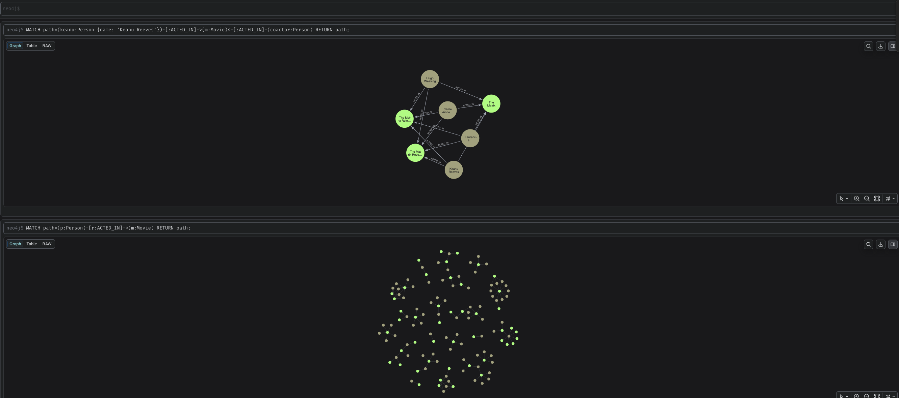
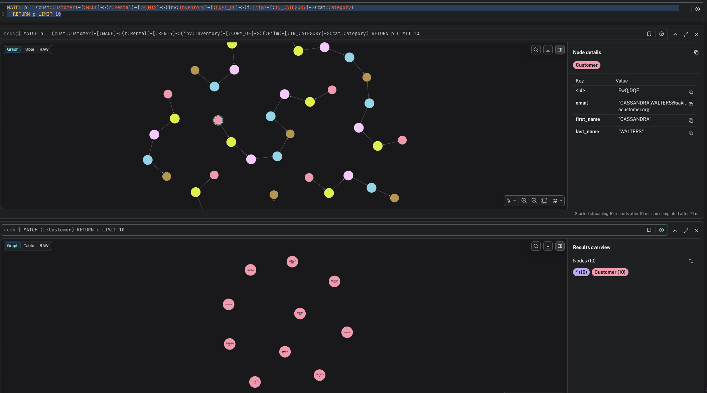

# Neo4j Virtual Graphs Playground

A hands-on sandbox for exploring the **Neo4j Virtual Graphs** feature, which lets you query relational database tables as if they were a native graph — using Cypher, with no ETL required.

The repository ships with five pre-configured backends split into two tiers:

| Tier | Backend | What makes it interesting |
|------|---------|--------------------------|
| **Simple** | [PostgreSQL](#simple-backends) | Single-service JDBC connection, classic movies graph |
| **Simple** | [Oracle Free](#simple-backends) | Single-service JDBC connection, classic movies graph |
| **Intermediate** | [Sakila](#sakila) | More complex relational schema — DVD rental store |
| **Advanced** | [LakeGraph](#lakegraph) | CSV files in MinIO, materialized by DuckDB on startup |
| **Advanced** | [IceGraph](#icegraph) | Pre-built Apache Iceberg tables (Parquet) in MinIO, queried via DuckDB |

---

## How It Works

Neo4j Virtual Graphs reads a small set of JSON configuration files (`datasource.json`, `schema.json`, `secret.json`) at startup and exposes the relational tables as virtual nodes and relationships. Queries execute live against the relational source — no data is copied into Neo4j.

---

## Prerequisites

- [Docker Desktop](https://www.docker.com/products/docker-desktop/) (or Docker Engine + Compose plugin)
- A valid **Neo4j Enterprise** license — the image used is `neo4j:2026.05.0-enterprise` and will not start without accepting the license agreement (already set in the compose file via `NEO4J_ACCEPT_LICENSE_AGREEMENT=yes`)
- For Oracle: the `gvenzl/oracle-free:23-slim` image takes 60–120 seconds to initialize on first run
- For LakeGraph: the DuckDB JDBC driver must be downloaded manually (see below)

---

## Quick Start

### 1. Choose a backend

Open `.env` and uncomment the line for the backend you want:

```dotenv
# PostgreSQL (movies graph)
# COMPOSE_FILE=docker-compose.yml:docker-compose-postgres.yml

# Oracle (movies graph)
# COMPOSE_FILE=docker-compose.yml:docker-compose-oracle.yml

# Sakila — DVD rental dataset
# COMPOSE_FILE=docker-compose.yml:docker-compose-sakila.yml

# LakeGraph — data lake via MinIO + DuckDB (movies graph)
# COMPOSE_FILE=docker-compose.yml:docker-compose-lakegraph.yml

# IceGraph — Apache Iceberg tables in MinIO, queried via DuckDB (movies graph)
# COMPOSE_FILE=docker-compose.yml:docker-compose-icegraph.yml
```

### 2. Start the stack

```bash
docker compose up -d
```

Docker Compose automatically reads `.env`, so no extra flags are needed. The database container starts first and Neo4j waits for its healthcheck to pass before booting.

### 3. Open Neo4j Browser

Navigate to `http://localhost:7474` and connect with:

| Field    | Value |
|----------|-------|
| URL      | `bolt://localhost:7687` |
| Username | `neo4j` |
| Password | `hellopassword` |

---

## Simple Backends

These backends wire a single database container directly to Neo4j via JDBC. They both expose the classic **movies graph**: `Person` nodes, `Movie` nodes, and `ACTED_IN` relationships.

```
(Person)-[:ACTED_IN {role}]->(Movie)
```

### PostgreSQL

| Property | Value |
|----------|-------|
| Image | `postgres:17-alpine` |
| Host port | `5488` |
| Database | `nvg` |
| User / Password | `nvg` / `nvg` |
| JDBC URL | `jdbc:postgresql://postgres-vg:5432/nvg` |

WAL logical replication is enabled (`wal_level=logical`) to support future CDC use cases.

### Oracle Free

| Property | Value |
|----------|-------|
| Image | `gvenzl/oracle-free:23-slim` |
| Host port | `1521` |
| PDB | `FREEPDB1` |
| Schema / Password | `NVG` / `nvg` |
| JDBC URL | `jdbc:oracle:thin:@//oracle-vg:1521/FREEPDB1` |

> Oracle's container takes 60–120 seconds to initialize on the first run. The healthcheck gates Neo4j startup automatically.

**Sample queries:**

```cypher
MATCH (m:Movie) RETURN m.title, m.release_year ORDER BY m.release_year DESC LIMIT 10

MATCH path = (p:Person)-[:ACTED_IN]->(m:Movie) RETURN path LIMIT 25

MATCH path = (keanu:Person {name: 'Keanu Reeves'})-[:ACTED_IN]->(m:Movie)<-[:ACTED_IN]-(co:Person)
RETURN path
```



---

## Advanced Backends

These backends involve multi-service stacks, richer graph models, and more interesting Cypher to write.

### Sakila

The [Sakila dataset](https://github.com/sakiladb/postgres) is a DVD rental store — customers, films, inventory, staff, stores, addresses. The graph model covers 12 node types and 16 relationship types.

| Property | Value |
|----------|-------|
| Image | `sakiladb/postgres:latest` |
| Host port | `5489` |
| Database | `sakila` |
| User / Password | `sakila` / `p_ssW0rd` |
| JDBC URL | `jdbc:postgresql://sakila-vg:5432/sakila` |

The image ships pre-populated — no `init.sql` needed.

```
(Actor)-[:ACTED_IN]->(Film)-[:IN_CATEGORY]->(Category)
(Customer)-[:MADE]->(Rental)-[:RENTS]->(Inventory)-[:COPY_OF]->(Film)
(Customer)-[:HAS_ADDRESS]->(Address)-[:IN_CITY]->(City)-[:IN_COUNTRY]->(Country)
(Store)-[:MANAGED_BY]->(Staff)-[:WORKS_AT]->(Store)
```

<details>
<summary>Full relationship table</summary>

| Relationship | Mapped from |
|---|---|
| `(Actor)-[:ACTED_IN]->(Film)` | `film_actor` junction table |
| `(Film)-[:IN_CATEGORY]->(Category)` | `film_category` junction table |
| `(Film)-[:IN_LANGUAGE]->(Language)` | `film.language_id` FK |
| `(Inventory)-[:COPY_OF]->(Film)`, `(Inventory)-[:IN_STORE]->(Store)` | `inventory` FKs |
| `(Customer)-[:MADE]->(Rental)-[:RENTS]->(Inventory)` | `rental` FKs |
| `(Rental)-[:PROCESSED_BY]->(Staff)` | `rental.staff_id` FK |
| `(Customer/Store/Staff)-[:HAS_ADDRESS]->(Address)` | respective table FKs |
| `(Address)-[:IN_CITY]->(City)-[:IN_COUNTRY]->(Country)` | `address`, `city` FKs |
| `(Store)-[:MANAGED_BY]->(Staff)`, `(Staff)-[:WORKS_AT]->(Store)` | `store`, `staff` FKs |
| `(Customer)-[:SHOPS_AT]->(Store)` | `customer.store_id` FK |

</details>

```cypher
// Rental journey: who rented what film in which category
MATCH p = (c:Customer)-[:MADE]->(r:Rental)-[:RENTS]->(inv:Inventory)-[:COPY_OF]->(f:Film)-[:IN_CATEGORY]->(cat:Category)
RETURN p LIMIT 10

// Actor → Film → Language chain
MATCH p = (a:Actor)-[:ACTED_IN]->(f:Film)-[:IN_LANGUAGE]->(lang:Language)
RETURN p LIMIT 10
```



> **Note:** PostgreSQL `boolean` columns (`activebool`, `active`) are not mapped — NVG's JDBC bit mapper cannot handle PostgreSQL's `t`/`f` wire format.

---

### LakeGraph

**An advanced data lake backend.** Instead of connecting to a relational database, this setup builds a full **data lake pipeline** and exposes it as a graph:

```
CSV files in MinIO (S3-compatible object storage)
    ↓  materialized on startup by DuckDB
DuckDB (embedded, file-based)
    ↓  read via JDBC driver (shared Docker volume)
Neo4j Virtual Graphs
    ↓  queried with Cypher
You
```

The movies dataset lives as CSV files in a MinIO bucket. On startup, DuckDB pulls them over S3 and materializes them as physical tables in a `.duckdb` file. Neo4j mounts that file via a shared Docker volume and connects using DuckDB's JDBC driver — no network connection to DuckDB, it's embedded directly in the JDBC layer.

#### Setup

**1. Download the DuckDB JDBC driver:**

```bash
cd config/lakegraph/jdbc
curl -O https://repo1.maven.org/maven2/org/duckdb/duckdb_jdbc/1.5.3.0/duckdb_jdbc-1.5.3.0.jar
```

**2. Start the stack:**

```bash
docker compose up --build -d
```

> Use `--build` any time you change files under `config/lakegraph/duckdb/` — Docker won't rebuild the image otherwise.

**Startup sequence:**

1. **MinIO** starts and passes its healthcheck
2. **minio-mc** uploads 5 CSV files to the `movies-data` bucket, then exits
3. **DuckDB** waits for mc to complete, then materializes 7 tables from MinIO and writes `movies.duckdb`
4. **Neo4j** waits for DuckDB's healthcheck (file exists), then mounts the volume and boots

#### Services

| Service | Port | Credentials |
|---------|------|-------------|
| MinIO API | `9000` | `minio` / `hellopassword` |
| MinIO Console | `9001` | `minio` / `hellopassword` |
| DuckDB CLI | — | `docker exec -it duckdb-playground duckdb /data/movies.duckdb` |

#### Graph model

```
(Person)-[:DIRECTED]->(Movie)
(Person)-[:ACTED_IN {character}]->(Movie)
(Movie)-[:IN_GENRE]->(Genre)
```

| Node | Source | Key properties |
|------|--------|----------------|
| `Movie` | `movies` table | `title`, `release_year`, `runtime_minutes`, `budget_usd`, `revenue_usd` |
| `Person` | `people` table | `name`, `birth_year`, `nationality` |
| `Genre` | `genres` table | `name` |

| Relationship | Source | Notes |
|---|---|---|
| `ACTED_IN` | `movie_actors` | derived from `movie_crew WHERE role = 'Actor'`; has `character` property |
| `DIRECTED` | `movie_directors` | derived from `movie_crew WHERE role = 'Director'` |
| `IN_GENRE` | `movie_genres` | junction table |

#### Sample queries

```cypher
// All paths through the graph
MATCH path = (p:Person)-[:ACTED_IN]->(m:Movie)-[:IN_GENRE]->(g:Genre)
RETURN path LIMIT 25

// Director → films → genres
MATCH path = (p:Person {name: 'Christopher Nolan'})-[:DIRECTED]->(m:Movie)-[:IN_GENRE]->(g:Genre)
RETURN path

// Actors in Crime films with budget info
MATCH (p:Person)-[:ACTED_IN]->(m:Movie)-[:IN_GENRE]->(g:Genre {name: 'Crime'})
RETURN p.name, m.title, m.release_year, m.budget_usd
ORDER BY m.release_year
```

#### Exploring DuckDB directly

```bash
docker exec -it duckdb-playground duckdb /data/movies.duckdb
```

```sql
SHOW TABLES;
SELECT title, revenue_usd FROM movies ORDER BY revenue_usd DESC LIMIT 5;
SELECT p.name, count(*) AS films
FROM people p JOIN movie_crew mc ON p.person_id = mc.person_id
WHERE mc.role = 'Actor'
GROUP BY p.name ORDER BY films DESC;
```

---

### IceGraph

**The most advanced backend.** IceGraph demonstrates a proper modern data lake stack — the movies dataset is stored as **Apache Iceberg tables** (Parquet data files + Iceberg metadata) in MinIO. DuckDB reads them natively via its `iceberg` extension and exposes them through Neo4j Virtual Graphs.

```
Pre-built Apache Iceberg warehouse (committed to the repo)
    ↓  uploaded to MinIO by minio-mc on startup
MinIO (S3-compatible object storage)
    ↓  iceberg_scan() via DuckDB iceberg extension
DuckDB (embedded, file-based)
    ↓  read via JDBC driver (shared Docker volume)
Neo4j Virtual Graphs
    ↓  queried with Cypher
You
```

The Iceberg warehouse (Parquet data files + Avro manifests + metadata JSON) is pre-generated and committed under `config/icegraph/warehouse/`. No runtime init container or catalog service is needed — `minio-mc` uploads the warehouse tree on startup and DuckDB reads it directly.

#### Setup

**1. Download the DuckDB JDBC driver** (shared with LakeGraph — skip if already done):

```bash
cd config/lakegraph/jdbc
curl -O https://repo1.maven.org/maven2/org/duckdb/duckdb_jdbc/1.5.3.0/duckdb_jdbc-1.5.3.0.jar
```

**2. Start the stack:**

```bash
docker compose up --build -d
```

**Startup sequence:**

1. **MinIO** starts and passes its healthcheck
2. **minio-mc** uploads the full Iceberg warehouse to the `iceberg-data` bucket, then exits
3. **DuckDB** waits for mc to complete, reads 7 Iceberg tables via `iceberg_scan`, and materializes them to `movies.duckdb`
4. **Neo4j** waits for DuckDB's healthcheck (file exists), then mounts the volume and boots

#### Services

| Service | Port | Credentials |
|---------|------|-------------|
| MinIO API | `9000` | `minio` / `hellopassword` |
| MinIO Console | `9001` | `minio` / `hellopassword` |
| DuckDB CLI | — | `docker exec -it duckdb-icegraph-playground duckdb /data/movies.duckdb` |

#### Graph model

Same as LakeGraph:

```
(Person)-[:DIRECTED]->(Movie)
(Person)-[:ACTED_IN {character}]->(Movie)
(Movie)-[:IN_GENRE]->(Genre)
```

| Node | Source table | Key properties |
|------|-------------|----------------|
| `Movie` | `movies` | `title`, `release_year`, `runtime_minutes`, `budget_usd`, `revenue_usd` |
| `Person` | `people` | `name`, `birth_year`, `nationality` |
| `Genre` | `genres` | `name` |

| Relationship | Source table | Notes |
|---|---|---|
| `ACTED_IN` | `movie_actors` | has `character` property |
| `DIRECTED` | `movie_directors` | |
| `IN_GENRE` | `movie_genres` | junction table |

#### Sample queries

```cypher
// All paths through the graph
MATCH path = (p:Person)-[:ACTED_IN]->(m:Movie)-[:IN_GENRE]->(g:Genre)
RETURN path LIMIT 25

// 3-hop path: actor → shared movie ← co-actor → another movie
MATCH path = (p:Person)-[:ACTED_IN]->(m:Movie)<-[:ACTED_IN]-(co:Person)-[:ACTED_IN]->(m2:Movie)
WHERE p <> co AND m <> m2
RETURN p.name AS actor, m.title AS shared_movie, co.name AS co_actor, m2.title AS other_movie
LIMIT 10

// Directors and their genres
MATCH (p:Person)-[:DIRECTED]->(m:Movie)-[:IN_GENRE]->(g:Genre)
RETURN p.name, collect(DISTINCT g.name) AS genres
```

#### Exploring DuckDB directly

```bash
docker exec -it duckdb-icegraph-playground duckdb /data/movies.duckdb
```

```sql
SHOW TABLES;
SELECT title, revenue_usd FROM movies ORDER BY revenue_usd DESC LIMIT 5;
-- The underlying Parquet files are in MinIO — browse them at http://localhost:9001
```

#### Regenerating the warehouse

The Iceberg warehouse is pre-built and committed. If you need to regenerate it (e.g. after changing the source CSVs), install PyIceberg in a temporary environment and run:

```bash
python3 -m venv /tmp/iceberg-gen
/tmp/iceberg-gen/bin/pip install "pyiceberg[sql-sqlite,pyarrow]" pyarrow
/tmp/iceberg-gen/bin/python3 - <<'EOF'
import os, shutil, pyarrow.csv as pcsv, pyarrow.compute as pc
from pyiceberg.catalog import load_catalog
from pyiceberg.io.pyarrow import pyarrow_to_schema
from pyiceberg.schema import Schema
from pyiceberg.types import NestedField, StringType, LongType
import pyarrow as pa

WAREHOUSE = os.path.abspath("config/icegraph/warehouse")
if os.path.exists(WAREHOUSE):
    shutil.rmtree(WAREHOUSE)
os.makedirs(WAREHOUSE)

catalog = load_catalog("local", **{
    "type": "sql",
    "uri": f"sqlite:///{WAREHOUSE}/iceberg_catalog.db",
    "warehouse": f"file://{WAREHOUSE}",
})
catalog.create_namespace("movies")

def iceberg_schema(pa_schema):
    fields = []
    for i, f in enumerate(pa_schema, 1):
        t = LongType() if pa.types.is_int64(f.type) or pa.types.is_int32(f.type) else StringType()
        fields.append(NestedField(i, f.name, t, required=False))
    return Schema(*fields)

def write(df, name):
    t = catalog.create_table(f"movies.{name}", schema=iceberg_schema(df.schema))
    t.overwrite(df)
    print(f"  {name}: {len(df)} rows")

crew = pcsv.read_csv("config/minio/movie_crew.csv")
write(pcsv.read_csv("config/minio/movies.csv"),      "movies")
write(pcsv.read_csv("config/minio/genres.csv"),      "genres")
write(pcsv.read_csv("config/minio/movie_genres.csv"),"movie_genres")
write(pcsv.read_csv("config/minio/people.csv"),      "people")
write(crew,                                           "movie_crew")
write(crew.filter(pc.equal(crew["role"],"Actor")).select(["movie_id","person_id","character_name"]), "movie_actors")
write(crew.filter(pc.equal(crew["role"],"Director")).select(["movie_id","person_id"]),               "movie_directors")
EOF

# Add version-hint.text and v1.metadata.json aliases for DuckDB compatibility
for table in movies genres movie_genres people movie_crew movie_actors movie_directors; do
  dir="config/icegraph/warehouse/movies/${table}/metadata"
  printf "1" > "${dir}/version-hint.text"
  cp "${dir}"/00001-*.metadata.json "${dir}/v1.metadata.json"
done
rm -f config/icegraph/warehouse/iceberg_catalog.db
```

---

## Repository Structure

```
.
├── .env                                      # Backend selector — edit this to switch
├── docker-compose.yml                        # Base Neo4j service definition
├── docker-compose-postgres.yml               # Simple: PostgreSQL overlay
├── docker-compose-oracle.yml                 # Simple: Oracle overlay
├── docker-compose-sakila.yml                 # Advanced: Sakila overlay
├── docker-compose-lakegraph.yml              # Advanced: LakeGraph (MinIO + DuckDB)
├── docker-compose-icegraph.yml               # Advanced: IceGraph (Iceberg + MinIO + DuckDB)
└── config/
    ├── minio/                                # Shared CSV source files (movies dataset)
    │   ├── movies.csv
    │   ├── genres.csv
    │   ├── movie_genres.csv
    │   ├── people.csv
    │   └── movie_crew.csv
    ├── postgres/
    │   ├── initdb/init.sql
    │   ├── jdbc/postgresql-42.7.11.jar
    │   └── nvg-config/
    ├── oracle/
    │   ├── initdb/init.sql
    │   ├── jdbc/ojdbc17.jar
    │   └── nvg-config/
    ├── sakila/
    │   └── nvg-config/
    ├── lakegraph/
    │   ├── duckdb/
    │   │   ├── Dockerfile
    │   │   ├── init.sql                      # Pulls CSVs from MinIO, creates 7 tables
    │   │   ├── duckdbrc                      # Auto-loaded S3 credentials for CLI sessions
    │   │   └── entrypoint.sh
    │   ├── jdbc/
    │   │   └── duckdb_jdbc-1.5.3.0.jar       # Download manually (see setup above)
    │   └── nvg-config/
    └── icegraph/
        ├── duckdb/
        │   ├── Dockerfile
        │   ├── init.sql                      # Reads 7 Iceberg tables via iceberg_scan
        │   └── entrypoint.sh
        ├── warehouse/                        # Pre-built Iceberg tables (committed)
        │   └── movies/
        │       ├── movies/                   # data/*.parquet + metadata/*.json + *.avro
        │       ├── genres/
        │       ├── movie_genres/
        │       ├── people/
        │       ├── movie_crew/
        │       ├── movie_actors/
        │       └── movie_directors/
        └── nvg-config/
            ├── datasource.json               # type: duckdb, path to mounted .duckdb file
            ├── secret.json
            └── schema.json
```

---

## Adding a New Backend

### 1. Create the config directory

```
config/<backend-name>/
├── initdb/init.sql      # DDL + seed data (if needed)
├── jdbc/<driver>.jar    # JDBC driver
└── nvg-config/
    ├── datasource.json
    ├── secret.json
    └── schema.json
```

### 2. NVG config files

**`datasource.json`** — use the Docker Compose service name as the JDBC host:

```json
{ "type": "generic", "url": "jdbc:<dialect>://<service-name>:<port>/<database>" }
```

**`secret.json`:**

```json
{ "type": "basic", "username": "<user>", "password": "<password>" }
```

**`schema.json`** — mirrors the structure of existing backends.

### 3. Docker Compose overlay

```yaml
services:
  my-db:
    image: ...
    healthcheck: ...

  neo4j:
    depends_on:
      my-db:
        condition: service_healthy
    volumes:
      - "./config/<backend>/jdbc/<driver>.jar:/var/lib/neo4j/lib/<driver>.jar"
      - "./config/<backend>/nvg-config:/nvg_home"
```

### 4. Register in `.env`

```dotenv
# COMPOSE_FILE=docker-compose.yml:docker-compose-<backend>.yml
```

### Checklist

- [ ] JDBC driver jar in `config/<backend>/jdbc/`
- [ ] `datasource.json` uses the Compose service name as JDBC host
- [ ] `schema.json` catalog/schema match the database dialect
- [ ] Healthcheck in the overlay reliably gates Neo4j startup
- [ ] `init.sql` is idempotent (`CREATE TABLE IF NOT EXISTS`, etc.)

---

## Stopping and Resetting

```bash
# Stop all containers (data volumes preserved)
docker compose down

# Full reset — deletes volumes, re-runs init on next start
docker compose down -v
```

---

## Credentials Reference

| Service | Username | Password |
|---------|----------|----------|
| Neo4j | `neo4j` | `hellopassword` |
| PostgreSQL (movies) | `nvg` | `nvg` |
| Oracle (movies) | `nvg` | `nvg` |
| Sakila (PostgreSQL) | `sakila` | `p_ssW0rd` |
| MinIO (LakeGraph) | `minio` | `hellopassword` |
| MinIO (IceGraph) | `minio` | `hellopassword` |
